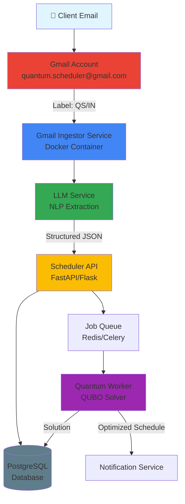
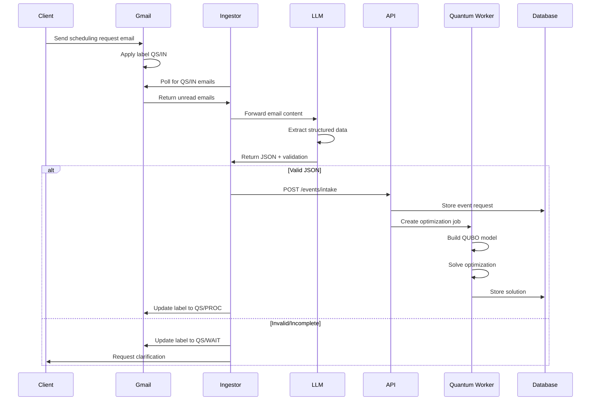
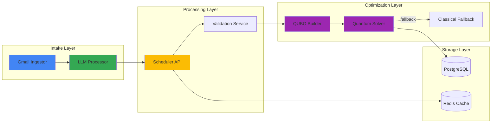
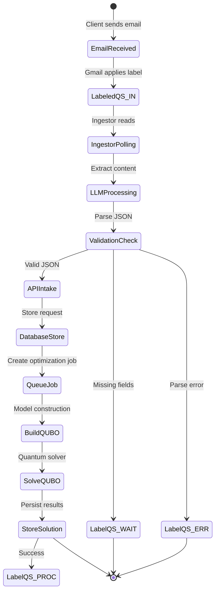
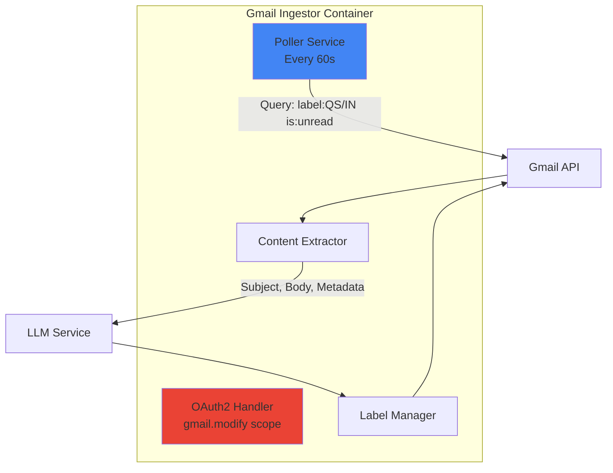
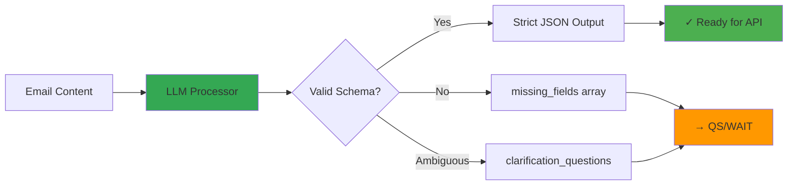
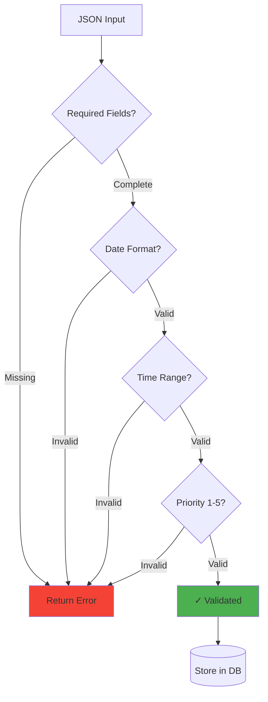
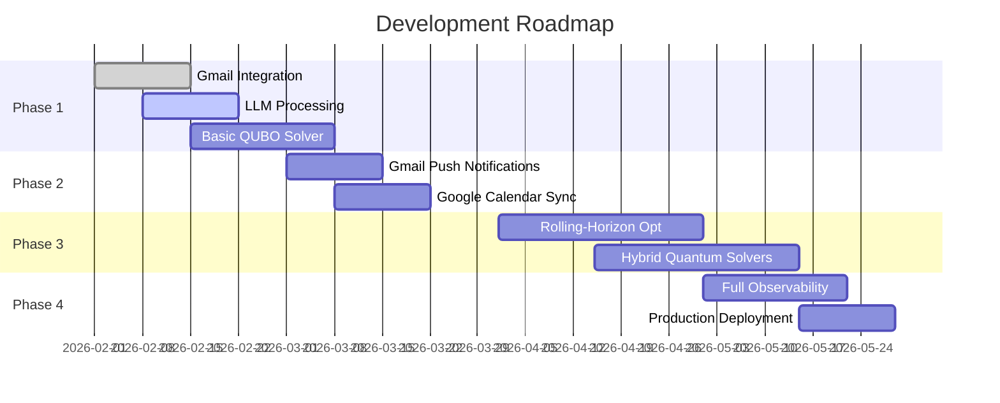

# Architecture & Procedure: Gmail + LLM + Quantum Scheduler (QUBO)

[](LICENSE)
[](https://www.python.org/downloads/)
[](https://www.docker.com/)

This document describes the end-to-end technical design and operational procedure to build a **quantum-inspired scheduling system** where client requests arrive via Gmail, are processed using a Large Language Model (LLM), transformed into structured JSON, and optimized using QUBO-based quantum or hybrid solvers.

---

## 📋 Table of Contents

- [System Objective](#-system-objective)
- [End-to-End Architecture](#-end-to-end-architecture)
- [System Components](#-system-components)
- [Data Flow](#-data-flow)
- [Gmail Configuration](#-gmail-configuration)
- [LLM Processing](#-llm-processing)
- [JSON Schema](#-json-schema)
- [QUBO Model](#-qubo-model)
- [Development Environment](#-development-environment)
- [Future Enhancements](#-future-enhancements)

---

## 🎯 System Objective

Automatically optimize the allocation of technical events and presentations to consultants and time slots (09:00–17:00), respecting constraints and preferences using quantum optimization techniques.

**Key Goals:**
- 📧 Seamless email-based intake system via Gmail
- 🤖 Intelligent extraction of scheduling requirements using LLM
- ⚛️ Quantum-inspired optimization for complex scheduling constraints
- 🔄 Automated workflow with minimal human intervention

---

## 🏗️ End-to-End Architecture



### System Flow



---

## 🔧 System Components

### Component Architecture



---

## 📊 Data Flow



---

## 📧 Gmail Configuration

### Dedicated Gmail Account

**Account:** `quantum.scheduler@gmail.com`

### Operational Labels

| Label | Purpose | Action |
|-------|---------|--------|
| `QS/IN` | New scheduling requests | Auto-applied by filters |
| `QS/PROC` | Successfully processed | Applied after optimization |
| `QS/WAIT` | Missing or ambiguous information | Requires clarification |
| `QS/ERR` | Parsing or validation errors | Human review needed |

**Important:** Emails are never deleted, only relabeled for audit trail.

### Gmail Ingestor Service

**Docker Container Specifications:**



**Responsibilities:**
- ✅ OAuth2 authentication (`gmail.modify` scope)
- ✅ Polling query: `label:QS/IN is:unread`
- ✅ Extract subject, sender, body
- ✅ Forward content to LLM service
- ✅ Update labels based on processing outcome

---

## 🤖 LLM Processing

### LLM Input Structure

The LLM receives:
- **Full email body** (plaintext or HTML-stripped)
- **Metadata:** From, Subject, Date
- **Expected JSON schema** for validation

### LLM Output Requirements



**Must Return:**
- ✅ Strict JSON compliant with schema
- ✅ `missing_fields[]` if information is incomplete
- ✅ `clarification_questions[]` if ambiguity exists

---

## 📄 JSON Schema

### Base JSON Schema (V1)

```json
{
  "client_name": "string",
  "event_title": "string",
  "description": "string",
  "preferred_consultant": "string | null",
  "consultant_required": false,
  "duration_min": 60,
  "time_window": {
    "earliest_date": "YYYY-MM-DD",
    "latest_date": "YYYY-MM-DD",
    "daily_start": "09:00",
    "daily_end": "17:00",
    "timezone": "Europe/Madrid"
  },
  "priority": 3
}
```

### Schema Validation Flow



---

## ⚛️ QUBO Model

### Quantum Optimization Overview

```mermaid
graph TB
    subgraph "QUBO Model Construction"
        Events[Events List] --> Vars[Binary Variables<br/>x(e,t,c)]
        Consultants[Consultants] --> Vars
        TimeSlots[Time Slots<br/>09:00-17:00] --> Vars
        
        Vars --> Constraints[Constraints Matrix]
        Constraints --> C1[Each event<br/>scheduled once]
        Constraints --> C2[No consultant<br/>overlap]
        Constraints --> C3[Valid working<br/>hours only]
        
        Constraints --> Obj[Objective Function]
        Obj --> O1[Minimize idle gaps]
        Obj --> O2[Respect preferences]
        Obj --> O3[Prioritize high-impact]
    end
    
    Obj --> QUBO[QUBO Matrix Q]
    QUBO --> Solver{Solver Type?}
    Solver -->|Quantum| QPU[QPU/Annealer]
    Solver -->|Hybrid| Hybrid[Hybrid Solver]
    Solver -->|Classical| SA[Simulated Annealing]
    
    QPU --> Solution[Optimal Schedule]
    Hybrid --> Solution
    SA --> Solution
    
    style QUBO fill:#9c27b0
    style Solution fill:#4caf50
```

### Binary Variables

$$x_{e,t,c} = \begin{cases} 1 & \text{if event } e \text{ is assigned to time slot } t \text{ with consultant } c \\ 0 & \text{otherwise} \end{cases}$$

### Constraints

1. **Each event scheduled exactly once:**
   $$\sum_{t,c} x_{e,t,c} = 1 \quad \forall e$$

2. **No consultant overlap:**
   $$\sum_{e} x_{e,t,c} \leq 1 \quad \forall t,c$$

3. **Valid working hours only:**
   $$x_{e,t,c} = 0 \text{ if } t \notin [09:00, 17:00]$$

### Objective Function

$$\min \left( \alpha \cdot \text{idle\_gaps} + \beta \cdot \text{preference\_penalty} + \gamma \cdot \text{priority\_penalty} \right)$$

Where:
- **α (idle gaps):** Minimize wasted time between events
- **β (preferences):** Respect consultant preferences
- **γ (priority):** Prioritize high-importance events

---

## 💻 Development Environment

### IDE & Tools

```mermaid
graph LR
    VSCode[Visual Studio Code] --> Copilot[GitHub Copilot]
    VSCode --> Docker[Docker Extension]
    VSCode --> Python[Python Extension]
    
    Copilot --> Assist[AI-Assisted Coding]
    Docker --> Containers[Container Management]
    Python --> Debug[Debugging & Testing]
    
    style VSCode fill:#007acc
    style Copilot fill:#000000
```



**Primary IDE:** Visual Studio Code  
**AI Assistant:** GitHub Copilot

### Repository Structure

```
quantum-scheduler/
├── gmail-ingestor/          # Email polling & processing
│   ├── Dockerfile
│   ├── src/
│   └── requirements.txt
├── scheduler-api/           # REST API & validation
│   ├── Dockerfile
│   ├── app/
│   └── requirements.txt
├── quantum-worker/          # QUBO solver
│   ├── Dockerfile
│   ├── solvers/
│   └── requirements.txt
└── docker-compose.yml       # Orchestration
```

### Technology Stack

| Component | Technology | Purpose |
|-----------|-----------|---------|
| **Ingestor** | Python 3.11+, Gmail API | Email polling |
| **LLM** | OpenAI API / Azure OpenAI | NLP extraction |
| **API** | FastAPI / Flask | REST endpoints |
| **Database** | PostgreSQL | Data persistence |
| **Queue** | Redis + Celery | Job management |
| **Solver** | D-Wave Ocean SDK / Qiskit | QUBO optimization |
| **Container** | Docker + Docker Compose | Orchestration |

---

## 🚀 Future Enhancements

### Roadmap



### Planned Features

- ✨ **Gmail push notifications** instead of polling
- 📅 **Google Calendar integration** for automatic event creation
- 🔄 **Rolling-horizon optimization** for dynamic rescheduling
- ⚡ **Hybrid quantum-classical solvers** for better performance
- 📊 **Full observability** (logs, metrics, distributed tracing)
- 🔐 **Enhanced security** with OAuth2 refresh tokens
- 🌐 **Multi-timezone support** for global teams
- 📱 **Mobile notifications** via Telegram/Slack
- 🎨 **Web dashboard** for schedule visualization

---

## 📖 Getting Started

### Prerequisites

```bash
# Install Docker
curl -fsSL https://get.docker.com -o get-docker.sh
sh get-docker.sh

# Install Docker Compose
sudo apt-get install docker-compose-plugin

# Clone repository
git clone https://github.com/rjamoriz/Architecture-Procedure-Gmail-LLM-Quantum-Scheduler-QUBO-.git
cd Architecture-Procedure-Gmail-LLM-Quantum-Scheduler-QUBO-
```

### Configuration

1. Set up Gmail OAuth2 credentials
2. Configure environment variables
3. Initialize database schema
4. Deploy with Docker Compose

*Detailed setup instructions coming soon...*

---

## 📝 License

MIT License - See [LICENSE](LICENSE) file for details

---

## 🤝 Contributing

Contributions are welcome! Please feel free to submit a Pull Request.

1. Fork the repository
2. Create your feature branch (`git checkout -b feature/AmazingFeature`)
3. Commit your changes (`git commit -m 'Add some AmazingFeature'`)
4. Push to the branch (`git push origin feature/AmazingFeature`)
5. Open a Pull Request

---

## 📧 Contact

Project Maintainer: [@rjamoriz](https://github.com/rjamoriz)

---

<div align="center">

**Built with ❤️ using Quantum Computing, AI, and Modern Cloud Architecture**

</div>
